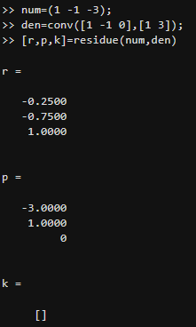
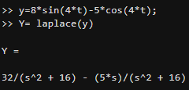
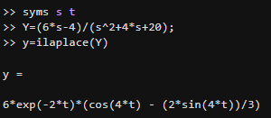

# Fracciones parciales método resumido:
La transformada inversa como ya se había mencionado anteriormente es una técnica que nos permite obtener la función original, es decir de una función de dominio de frecuencia compleja la convierte en una función de dominio del tiempo, lo opuesto a la transformada de Laplace. A continuación se explicará de forma breve la manera de realizar ejercicios por medio de la transformada inversa con diferentes casos.

## 1. Método resumido: 
Se debe factorizar las raíces del polinomio del numerador, de esta manera disminuye el sistema de ecuaciones a solucionar al identificar valores de s y así poder eliminar algunos términos. 
### 1. 1 Caso de raíces reales diferentes:
Es importante buscar los valores del denominador que deben ser lineales diferentes y se cancelen.

$$F(s) = \frac{A(s)}{B(s)} = \frac{a_1}{s+p_1} + \frac{a_2}{s+p_2} + \cdots + \frac{a_n}{s+p_n}$$

Sabiendo que $\( a_k \) (\( k = 1, 2, 3, \ldots \))$ son constantes, $\( a_k \)$ puede hallarse multiplicando ambos lados de la igualdad por $\( (s+p_k) \)$ y haciendo $\( s = -p_k \)$, de lo cual se obtiene:

$$\left[ (s + p_k) \left( \frac{A(s)}{B(s)} \right) \right]_{s = -p_k} = \left[ \frac{a_1}{s + p_1} \right] (s + p_k) + \left[ \frac{a_2}{s + p_2} \right] (s + p_k) + \cdots + \left[ \frac{a_k}{s + p_k} \right] (s + p_k)$$

$$+ \cdots + \left[ \frac{a_k}{s + p_k} \right] (s + p_k) \Big|_{s = p_k} = a_k$$

$$a_k = \left[ (s + p_k) \frac{A(s)}{B(s)} \right]_{s = -p_k}$$

Se cancelan todas menos $$a_k$$

### Transformada inversa caso 1

De la tabla de transformadas

$$f(t) = L^{-1}\{F(s)\} \)$$ $$( F(s) = L\{f(t)\} \)$$

$$2e^{at} \)$$  $$\frac{1}{s-a}$$

$$L^{-1}\left\[\frac{a_k}{s+p_k}\right\] = a_k e^{-p_k t}$$

$$f(t) = L^{-1}[F(s)] = a_1 e^{-p_1 t} + a_2 e^{-p_2 t} + \cdots + a_n e^{-p_n t}$$

### 💡Ejemplo 1:

Obtenga la transformada inversa de:

$$F(s) = \frac{s+3}{(s+1)(s+2)}$$

$$\frac{s+3}{(s+1)(s+2)} = \frac{A}{\frac{s+1}{-1}} + \frac{B}{\frac{s+2}{-2}}$$

$$\left[(s+1) \frac{s+3}{(s+1)(s+2)}\right]_{s=-1} = A = \frac{(-1)+3}{-1+2} = 2$$

Igual para B:

$$\left[(s+2) \frac{s+3}{(s+1)(s+2)}\right]_{s=-2} = B = \frac{(-2)+3}{-2+1} = \frac{-1}{1} = -1$$

$$\frac{2}{s+1} - \frac{1}{s+2}$$

$$= 2L^{-1}\left\[\frac{1}{s+1}\right\] - L^{-1}\left\[\frac{1}{s+2}\right\]$$

$$= 2e^{-t} - e^{-2t}$$

### 1.2 Caso de raíces reales iguales:
Se puede aplicar el mismo principio, pero teniendo en cuenta los exponente. 
### 💡Ejemplo 2:

$$F(s) = \frac{s^2 + 2s + 3}{(s+1)^3}$$

$$F(s) = \frac{A(s)}{B(s)} = \frac{b_3}{(s+1)^3} + \frac{b_2}{(s+1)^2} + \frac{b_1}{s+1}$$

$$(s+1)^3 \frac{A(s)}{B(s)} = b_3 + b_2(s+1) + b_1(s+1)^2$$

tomamos s=-1

$$\frac{(s+1)^3 (s^2 + 2s + 3)}{(s+1)^3} \bigg|_{s=-1} = A = (-1)^2 + 2(1) + 3 = 2=A$$

Para el siguiente término se deriva u se evalua en s=-1

$$\frac{d}{ds} \left[ (s+1)^3 \frac{A(s)}{B(s)} \right]_{s=-1} \frac{d}{ds} \left[ A + B(s+1) + C(6+1)^2 \right]{s=-1}$$

$$\left[(s+1)^{3} \frac{A(s)}{B(s)}\right]_{s=-1} = 0 +B + 2C(s+1)$$

$$0 = B + 2C(s+1)$$

$$0 = B + 2C(-1+1)$$

$$ B = 0$$

Se deriva nuevamente: 

$$\frac{d}{ds} \left[ (s+1)^2 \frac{A(s)}{B(s)} \right]{s=-1} = \frac{d}{ds} \left[ B + 2C(s+1) \right]{s=-1} = 2C$$

$$2C = \left[ (s+1)^2 \frac{A(s)}{B(s)} \right]_{s=-1}$$

$$2C = \left[ \frac{s^2 + 2s + 3}{s+1} \right]_{s=-1}$$
$$ c=\frac{2}{2}= 1$$

$$L^{-1}\left[\frac{2}{(s+1)^{3}}\right] + L^{-1}\left[\frac{1}{s+1}\right]$$

$$s+1-> s$$

$$e^{-t}$$

$$\frac{1}{s^{3}}= \frac{n!}{s^{n+1}}= t^{n}$$

$$\frac{1}{2!} \frac{2!}{s^{2+1}}$$

$$2 \frac{1}{2} t^{2}$$

### 1.3 Caso 3: raíces complejas conjugadas
Para este se puede completar el cuadrado

$$F(s) = \frac{2s + 12}{s^2 + 2s + 5}$$

Si las raíces son complejas tal que:

$$s^2 + 2s + 5 = (s+1+j2)(s+1-j2)$$

### 💡Ejemplo 3:

$$F(s) = \frac{2s + 12}{s^2 + 2s + 5} = \frac{2s + 12}{(s+1)^2 + 4}$$

Se saca trinomio cudrado perfecto:

$$s^{2}+2s+1-1+5 = (s+1)^{2}4$$ 

Ahora modificamos el numerador para el seno y coseno amortiguado:

$$F(s) = \frac{10 + 2(s+1)}{(s+1)^2 + 4} = \frac{10}{(s+1)^2 + 4} + \frac{2(s+1)}{(s+1)^2 + 4}$$

$$= 10 \mathcal{L}^{-1}\left\[\frac{1}{(s+1)^2 + 2^2}\right\] + 2 \mathcal{L}^{-1}\left\[\frac{s+1}{(s+1)^2 + 2^2}\right\]$$

$$= 10 e^{-t} \left\[\frac{1}{2} \sin(2t)\right\] + 2 e^{-t} \cos(2t)$$

$$= 5 e^{-t} \sin(2t) + 2 e^{-t} \cos(2t)$$

## 2.Matlab: 
Es un entorno de programación y cálculo desarrollado por MathWorks, tiene un lenguaje de programación propio y permite desarrollar operaciones con matrices y vectores, que facilita cálculos matemáticos complejos, también cuenta con herramientas para crear gráficos en 2D y 3D.

### 2.1 Fracciones parciales de Matlab:
Al conocer los polinomios del numerador y denominador de la función de dominio s puede calcular los términos de las fracciones parciales. 

r => términos del numerador

p => términos del denominador

k => términos independientes

$$F(s) = \frac{s^2 - s - 3}{s(s - 1)(s + 3)} = \frac{0.75}{s - 3} - \frac{0.75}{s + 1} + \frac{1}{s}$$

### 2.2 Transformada de Laplace en Matlab(directa): 

Transfrome al dominio $s = 8 \sin(4t) - 5 \cos(4t)$

· Para obtener la transformada de Lplace Y(s), el comando syms generan las variables t y s para pasar del dominio t al dominio s

· la notaciòn con minúscula supone una función definida en t.

Y la notaciòn con mayúsculas indica una función transformada

Y= laplace(y)

y= 32/(s^2+ 16) - (5*s)/ (s^2+16)

Por lo tanto:

$$\mathcal{L} \{ 8 \sin(4t) - 5 \cos(4t) \} = \frac{32}{s^2 + 16} - \frac{5s}{s^2 + 16}$$

### 2.3 Transformada inversa de Laplace en Matlab:

Obtenga la transformada inversa de $Y(s)=\frac{6s - 4}{s^2 + 4s + 20}$

La transformada inversa de Laplace se obtiene con el comando syms que genera variables s y t para pasar de dominio s al dominio t 

la notaciòn con mayúsculas supone funciones en s

y= 6*exp(-2*t) * (cos(4*t) - (2*sin(4*t))/3)

Entonces:

$$\mathcal{L}^{-1}\left\[\frac{6s - 4}{s^2 + 4s + 20}\right\] = 6e^{-2t} \cos(4t) - 4e^{-2t} \sin(4t)$$

## 3. Solución ecuaciones diferenciales:
### 3.1 Metodología de solución:
Aplicar transformad ade Laplace a toda la ecuación(término a término)

Despejar la variable

Aplicar transformada de Laplace a la expresión obtenida para obtener la solución en el dominio del tiempo. 

### 💡Ejemplo 4:

$$\ddot{x} + 3\dot{x} + 2x = 0$$

$$x(0) = a, \quad \dot{x}(0) = b$$

$$\mathcal{L}\{\ddot{x}\} + 3\mathcal{L}\{\dot{x}\} + 2\mathcal{L}\{x\} = 0$$

$$s^2\mathcal{L}\{x\} - x_0s - \dot{x}_0 + 3(s\mathcal{L}\{x\} - x_0) + 2\mathcal{L}\{x\} = 0$$

$$s^2\mathcal{L}\{x\} - as - b + 3s\mathcal{L}\{x\} - 3a + 2\mathcal{L}\{x\} = 0$$

$$\mathcal{L}\{x\}(s^2 + 3s + 2) = as + b + 3a$$

$$\mathcal{L}\{x\} = \frac{as + b + 3a}{s^2 + 3s + 2} = \frac{as + b + 3a}{(s+1)(s+2)} = \frac{2a+b}{s+1} - \frac{a+b}{s+2}$$

Aplicando la Transformada Inversa de Laplace:

$$x = \mathcal{L}^{-1}\{\mathcal{L}\{x\}\} = \mathcal{L}^{-1}\left\[\frac{2a+b}{s+1}\right\] - \mathcal{L}^{-1}\left\[\frac{a+b}{s+2}\right\]$$

$$= (2a+b)e^{-t}- (a+b) e^{-2t}$$

### 💡Ejemplo 5:

$$\ddot{x} + 2\dot{x} + 5x = 3$$

$$x(0) = 0, \quad \dot{x}(0) = 0$$

$$\mathcal{L}\{\ddot{x}\} + 2\mathcal{L}\{\dot{x}\} + 5\mathcal{L}\{x\} = \mathcal{L}\{3\}$$

$$s^2\mathcal{L}\{x\} - x_0s - \dot{x}_0 + 2(s\mathcal{L}\{x\} - x_0) + 5\mathcal{L}\{x\} = \frac{3}{5}$$

$$s^2\mathcal{L}\{x\} - (0s^0) - 0 + 2s\mathcal{L}\{x\} + 5\mathcal{L}\{x\} = \frac{3}{5}$$

$$\mathcal{L}\{x\}(s^2 + 2s + 5) = \frac{3}{5}$$

$$\mathcal{L}\{x\} = \frac{\frac{3}{5}}{s^2 + 2s + 5} = \frac{\frac{3}{5}}{(s+1)^2 + 4}$$

$$= 3 L^{-1}{\frac{1}{5}}+ 3 L^{-1} {\frac{1}{(s+1)^{2}+ 2^{2}}}$$

$$3 e^{-t} \mathcal{L}^{-1} \left[ \frac{1}{2} \cdot \frac{2}{(s+1)^{2} + 2^{2}} \right]$$

$$= \frac{3}{5((s+1)^2 + 4)} = \frac{3}{5} + \frac{3}{(s+1)^2 + 4}$$

$$\frac{3}{s((s+1)^2 + 4)} = \frac{A}{s} + \frac{Bs+C}{s^2 + 2s + 5}$$

$$3 = A(s^2 + 2s + 5) + (Bs+C)s$$

$$3 = As^2 + 2As + 5A + Bs^2 + Cs$$

- \(s^2: 0 = A + B\)

  
- \(s^1: 0 = 2A + C\)
  
  
- \(s^0: 3 = 5A\)

$$\mathcal{L}\{x\} = \frac{3}{5s} - \frac{3s}{5(s^2 + 2s + 5)} - \frac{6}{5(s^2 + 2s + 5)}$$

$$= \frac{3}{5s} - \frac{3s}{5((s+1)^2 + 4)} - \frac{6}{5((s+1)^2 + 4)}$$
  
$$x(t) = \mathcal{L}^{-1}\left\[\frac{3}{5s}\right\] - \mathcal{L}^{-1}\left\[\frac{3s}{5((s+1)^2 + 4)}\right\] - \mathcal{L}^{-1}\left\[\frac{6}{5((s+1)^2 + 4)}\right\]$$  

$$= \frac{3}{5} - \frac{3}{5}e^{-t}\cos(2t) - \frac{3}{10}e^{-t}\sin(2t)$$

## Ejercicios propios:

### Ejercicio 1:

### Resolución de la Ecuación Diferencial usando Transformada de Laplace

Dada la ecuación diferencial:

$$x'' + 2x' - 3x = 0$$

Con las condiciones iniciales:

$$x(0) = -1$$  
$$x'(0) = 3$$  

### Aplicación de la Transformada de Laplace:

$$L[x''] + 2L[x'] - 3L[x] = 0$$

Sustituyendo las fórmulas de las transformadas:

$$s^2 L[x] - x(0)s - x'(0) + 2(s L[x] - x(0)) - 3 L[x] = 0$$

Sustituyendo las condiciones iniciales:

$$s^2 L[x] + s - 3 + 2s L[x] + 2 - 3 L[x] = 0$$

Factorizando:

$$L[x](s^2 + 2s - 3) = -s + 3 - 2$$

Resolviendo para \(L[x]\):

$$L[x] = \frac{-s + 1}{s^2 + 2s - 3}$$

Factorizando el denominador:

$$L[x] = \frac{-s + 1}{(s + 3)(s - 1)}$$

Descomponiendo en fracciones parciales:

$$L[x] = -\frac{1}{s + 3}$$

Aplicando la transformada inversa:

$$x = -L^{-1} \left( \frac{1}{s + 3} \right) = -e^{-3t}$$

#### Solución Final:

$$x(t) = -e^{-3t}$$

### Ejercicio 2:

Dada la función de transferencia:

$$G(s) = \frac{1}{s^2 + 6s + 13}$$

Factorizando el denominador:

$$s^2 + 6s + 13 = (s +3)^2 + 4$$

Reescribiendo la expresión:

$$G(s) = \frac{1}{(s + 3)^2 + 4}$$

Aplicando la propiedad del desplazamiento en la transformada de Laplace:

$$s + 3 \longrightarrow s$$

Esto implica un factor exponencial en el dominio del tiempo:

$$e^{-3t}$$

La expresión resultante es:

$$G(s) = e^{-3t} \cdot L^{-1}{ \frac{1}{s^2 + 4} }$$

La transformada inversa de \( \frac{1}{s^2 + 4} \) es:

$$L^{-1}{ \frac{2}{s^2 + 2^2} } = \frac{1}{2} \sin(2t)$$

Por lo tanto, la solución es:

$$G(t) = \frac{1}{2} e^{-3t} \sin(2t)$$

