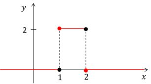

# Transformada de Laplace: 
Es una técnica desarrollada por Pierre Laplace que permite resolver ecuaciones diferenciales, tiene diversas aplicaciones en el análisis de sistemas dinámicos,  a continuación veremos un enfoque en ecuaciones diferenciales y modelos matemáticos (1). 

>🔑*Sistemas:* Es un conjunto de elementos organizados que interactúan entre sí para lograr un objetivo, se puede representar por medio principios que relacionan salidas con entradas, y cada sistema puede existir dentro de otro más grande. Los sistemas son limitados, estas limitaciones pueden ser físicas (hardware) o conceptuales (software)(2).

>🔑*Entrada:* Es una energía externa al sistema que genera un cambio de estado. Usualmente es representada por la letra U(3).

>🔑Salida: Es el estado de un sistema posterior a un tiempo de presentar condiciones iniciales distintas a cero o aplicar una entrada(3). 

>🔑Sistema dinàmico: E un sistema cuyo estado evoluciona con el tiempo, a razón de una función de sus estado actual u otros factores. Es cuando su salida en el presente depende de una entrada en el pasado(4).

>🔑Sistema estàtico: Es un sistema donde las variables permanecen constantes a lo largo del tiempo. Es cuando su salida depende solamente de la entrada en curso(4). 

>🔑Planta: Todo lo físico que permite llevar a cabo un proceso y se puede representar matemáticamente o por sistemas. 

>🔑Proceso: Secuencia de pasos para el desarrollo o fabricación de un objeto o producto.

>🔑Modelos dinámicos: Son modelos que estudian la evolución de las variables 
respecto al tiempo y se debe cuantificar el cambio por medio de ecuaciones(4).
Se busca obtener un modelo matemàtico que relacione las variables de interès con el tiempo.
  f(t)
se debe cuantificar el cambio por medio de ecuaciones.

$$\frac{df(t)}{dt}$$
  
>🔑La derivada: Es una función que describe el porqué del cambio instantáneo de una función en cierto punto,presenta la pendiente de una recta tangente en un punto de la función(5). 
Esto por medio de una ecuación:

$$\lim_{h \to0 }\frac{f(x+h)-f(x)}{h}$$
💡 Ejemplo 1:
$$f(x)= x^{2}$$
$$\frac{df(x)}{dx}= 2x$$

$$\frac{df(2)}{dx}= 2(2)=4$$

$$\frac{df(3)}{dx}= 2(3)=6$$

$$\frac{df(0)}{dx}= 2(0)=0$$

## 1. ¿Cómo lucen los modelos de ecuaciones diferenciales?: 

Son combinaciones lineales de derivadas de diferente orden: 
 
 $$a_{1}\frac{d^{2}f}{dt}+a_{2}\frac{df}{dt}+a_{3}f=u(t)$$ 
 
F: Salida del sistema

U: Entrada del sistema

La solución de esto no es un número es una función.

## 2.Características de una ecuación diferencial: 
>🔑Principio de superposición: Es la suma de respuestas individuales cuando un sistema responde  al aplicar 2 o más excitaciones simultáneas.
### 2.1 Ecuación lineal invariante en el tiempo: 
Esta describe un sistema que tiene dos propiedades fundamentales, la linealidad e invarianza en el tiempo, dichas propiedades simplifican el análisis de sistemas y su diseño, esto se debe a que la linealidad cumple con el principio de superposición y por otro lado, la invarianza permite que si aplicas una entrada se obtendrá el mismo resultado a pesar del desplazamiento en tiempo(6).

$$\frac{d^{2}x(t)}{dt^{2}}+10x(t)=0$$

### 2.2 Ecuación lineal variante en el tiempo: 
Esta describe un sistema donde sus características cambian con el tiempo, lo que significa que su relación entre entrada y salida del sistema no son constantes, pero la relación entre las variables es proporcional(6).

$$\frac{d^{2}x(t)}{dt^{2}}+(1-cos(2t))x(t)=0$$
  
### 2.3 Ecuación no lineal variante en el tiempo: 
Esta describe relaciones entre variables de mayor complejidad, se caracteriza porque la ecuación es dependiente del tiempo debido a los cambios de las variables a razón de este(7).

$$\frac{d^{2}x(t)}{dt^{2}}+ (x^{2}(t)-1)\frac{dx(t)}{dt}+x(t)=0$$

### 2.4 Ecuación no lineal invariante en el tiempo: 
Describe un sistema con características que no cambian con el tiempo, pero que no tiene proporcionalidad entre la entrada y salida del sistema(7). 
            
$$\frac{d^{2}x(t)}{dt^{2}}+\frac{dx(t)}{dt}+x(t)+x^{3}(t)=sen(\omega  t)$$

## 3.Sistemas lineales y no lineales: 
Teoría de sistemas analiza y diseña componentes que interactúan en una configuración que brinde un comportamiento deseado.
### 3.1 Sistema lineal: 
Es cuando cumple con el principio de superposición, es decir que al combinar entradas de forma lineal se tendrá una respuesta en la salida igual en cada entrada individual, también se caracteriza por la proporcionalidad entre la entrada y la salida. Lo anterior permite un análisis matemático sencillo porque son sistemas bien establecidos(7). 
### 3.2 Sistema no lineal:
Este tipo de sistema no cumple con el principio de superposición, ni tampoco tiene proporcionalidad entre la entrada y la salida. Estos se alinean en un punto de operación para que cumplan con el principio, pero presentan múltiples puntos de equilibrio y caos, lo que hace que su análisis sea de mayor complejidad(7).

## 4.Modelamiento y validación: 
Hay un nivel de incertidumbre en el resultado final al aplicar leyes físicas a un modelo matemático o sistema. 
Para validar el modelo se compara la salida del modelo con la salida de modelo físico, de esta manera se valida el modelo respecto al sistema, se debe modificar el modelo hasta que se consiga una diferencia aceptable entre ellos(7). 
## 5.Influencia de parámetros:
### 5.1 Comportamiento sinusoidal: 
Se refiere a un patrón que se repite de forma regular, que gráficamente se ve como una curva oscilante. Esta se representa como la función de seno(8).

### 5.2 Decaimiento exponencial:
Se observa un decrecimiento acelerado debido a un fenómeno de variación exponencial. Este decaimiento es proporcional al valor de la medida o cantidad actual y es constante. Esto se modela matemáticamente por medio de una función exponencial con base entre 0 y 1 (9). 

### 5.3 Combinación de los dos anteriores: 
Se presenta una oscilación que pierde amplitud gradualmente con el paso del tiempo siguiendo la función de decaimiento exponencial(8).

## 6.Transformada de Laplace:
Es un cambio de espacio geométrico del dominio del tiempo hacia el dominio de la frecuencia compleja, esta muestra las exponenciales y sinusoidales presentes en una señal. 
Es una técnica para resolver ecuaciones diferenciales transformándose en algebraicas(10).
Es la función f(t) una función continua por trozos, que se denota como una integral impropia: 

𝒙 𝒕 → 𝑿(𝒔)

$$x(s)=\int _{0}^{∞} x(t)* e^{-s*t}$$

$$s= \alpha + j\omega$$ 

Su notación es:

L{𝑓(𝑡)} = 𝐹(𝑠)

## 7. Transformada inversa de Laplace: 
Esta es una técnica opuesta a la transformada de laplace donde se tendrá F(s), donde se debe hallar las funciones originales para haber obtenido dicha transformada(10). 

𝐗 𝒔 → 𝒙(𝒕)
$$x(t)=\frac{1}{2\pi j}\int_{c-j∞}^{c+j∞}$$     
$$x(s)e^{-s*t} ds$$

Su notación es: 

L’ −1 {𝐹(𝑠)} = 𝑓(𝑡)

Es importante tener en cuenta lo siguiente:

· Para funciones simples utilizar la tabla de transformadas

· Para funciones que son una composición de varias funciones:

    -Calcular la integral de la definición de la transformada inversa de Laplace.
  
    -Realizar una expansión en fracciones parciales para obtener una suma de funciones mucho más simples que se puedan 
     encontrar en las tablas.

## 8.Algunas propiedades de la transformada de Laplace:
La transformada de laplace tiene diversas propiedades que se pueden aplicar a los problemas de valor inicial en ecuaciones diferenciales o para su definición(10). Algunas de estas propiedades son:  
### 8.1 Propiedad de linealidad: 
Esta propiedad se da por dos funciones que se establecen linealmente, las cuales son f, g ∈ E (10).
Se representan de esta forma: 
     
$$L[C1f(t)+C2 g(t)] = C1L[f(t)] + C2L[g(t)], C1, C2 ∈ IR$$

Esto permite tomar constantes fuera de la transformada y descomponer funciones complejas en sumas de funciones más simples. 

### 8.2 Desplazamiento en t: 
Es decir desplazamiento en el tiempo, esta permite el análisis de sistemas lineales invariantes en el tiempo,  se describe como un desplazamiento en el tiempo de una función en dominio del tiempo que afecta su función en dominio de una frecuencia. Permite la resolución de ecuaciones diferenciales donde las condiciones iniciales están desplazadas en el tiempo(10).

Si $g(t)=f(t-\tau)u(t-\tau )$

Entonces $$G(s)=e^{-ST} F(s)$$ , $$\tau \geq 0$$

### 8.3  Desplazamiento en S: 
Se conoce como desplazamiento de frecuencia, es una propiedad que permite analizar la multiplicación de una función en el dominio del tiempo por una función exponencial, representa un cambio de frecuencia del sistema. Esta propiedad permite analizar sistemas que poseen términos exponenciales(10).

Si $g(t)= f(t-\tau )$

Entonces $$G(s)=F(s+a)$$ , $$a\geq 0$$

### 8.4 Propiedad de escalado en t: 
Esta describe un cambio en la escala del tiempo de una función, lo cual afecta su transformada de Laplace.  Permite analizar cambios de velocidad o frecuencia de un sistema(10).

Si $g(t)=f(kt)$

Entonces $$G(s)=\frac{1}{k} F (\frac{s}{k})$$

## 9. Funciones de la transformada de Laplace: 
### 9.1 Transformada escalón unitario: 
Es una función que permite el análisis de señales y sistemas, se usa para representar causales, es decir para sistemas que su salida depende sólo de entradas presentes y pasadas, es decir para ecuaciones diferenciales con entradas discontinuas (11).

$$l(t)=0$$ para t<0

= 1 para t>0

$$L[l(t)]=\frac{1}{s}$$ 

### 9.2 Transformada función rampa: 
Esta comienza en cero y aumenta linealmente con el  tiempo, permite analizar funciones que aumentan linealmente, está definida por una pendiente, tiene un valor de = 0 en un intervalo definido por t < 0(11). 
Se define de la siguiente forma : 

$$f(t)=0 para t<0 $$

$$ = At  para  t\geq 0 $$

$$ L\left[ At \right]=$$

La transformada de Laplace de \( At \) es:

$$
\mathcal{L}\left[ At \right] = \int_{0}^{\infty} Ate^{-st}dt
$$

Aplicando la integración por partes:

$$\mathcal{L}\left[ At \right] = At \frac{e^{-st}}{-s} \Big|_0^\infty - \int_0^\infty \frac{Ae^{-st}}{-s} dt$$

$$=\frac{A}{s}\int_{0}^{\infty} e^{-st} dt$$

$$=\frac{A}{s^{2}}$$

### 9.3 Transformada función senoidal: 
Es una función que permite resolver problemas que involucran oscilaciones que permite analizar sistema de entrada senoidal(11). 

Sea la función $f(t)$ definida como:

$$
f(t) = \begin{cases} 
0 & \text{para } t < 0 \\
A \sin(\omega t) & \text{para } t \geq 0
\end{cases}
$$

Donde:

* $A$ es la amplitud de la función seno.
* $\omega$ es la frecuencia angular.

Utilizando la identidad trigonométrica:

$$
\sin(\omega t) = \frac{1}{2j} (e^{j\omega t} - e^{-j\omega t})
$$

La transformada de Laplace de $f(t)$ se calcula como:

$$
\mathcal{L}\{A \sin(\omega t)\} = \frac{A}{2j} \int_{0}^{\infty} (e^{j\omega t} - e^{-j\omega t}) e^{-st} dt
$$

Resolviendo la integral, obtenemos:

$$
\mathcal{L}\{A \sin(\omega t)\} = \frac{A}{2j} \left( \frac{1}{s - j\omega} - \frac{1}{s + j\omega} \right) = \frac{A\omega}{s^2 + \omega^2}
$$

Por lo tanto, la transformada de Laplace de $A \sin(\omega t)$ es:

$$\frac{A\omega}{s^2 + \omega^2}$$

### 9.4 Transformada de una función
Es cuando una función de una variable (usualmente tiempo) se convierte en otra función con una variable diferente (frecuencia) (10).

$$\mathcal{L} \{ f(t) \} = F(s)$$

### 9.5 Transformada de la derivada
Establece una relación entre la transformada de Laplace de una función con la transformada de Laplace de la función original. Permite convertir una derivada del dominio del tiempo en una operación algebraica(10).

$$\mathcal{L} \{ f'(t) \} = s F(s) - f(0)$$

$$\mathcal{L} \{ f''(t) \} = s^2 F(s) - s f(0) - f'(0)$$

$$\mathcal{L} \{ f^{(n)}(t) \} = s^n F(s) - s^{n-1} f(0) - \dots - s f^{(n-1)}(0) - f^{(n)}(0)$$

### 9.6 Transformada de la integral
Establece una relación entre la transformada de Laplace de una integral con la transformada de Laplace de la función original(10).

$$L \left[{\int{f(t)dt}}\right]= \frac{1}{s} F(s)$$

## 10. Tabla de transformadas
Es una tabla que provee pares funciones de la mayoría de transformadas de Laplace, lo que permite encontrar la transformada de una función y, así mismo, la transformada inversa(10).

## 11. Conclusión: 
La trasfromada de Laplace es una técnica matemàtica muy importante ya que nos permite comprender y resolver ecuaciones diferenciales, esto gracias a que convierte las ecuaciones diferenciales complejas en ecuaciones algebraica ya que presenta diversas propiedades que permiten que se adapte a diferentes casos, esto facilita el análisis de sistemas dinàmicos y se puede aplicar sobre todo a sistemas con variables que cambian con el tiempo. 
Lo anterio hace que la transformada de Laplce sea una herramienta que no solo es fundamental en el campo del análisis matemàtico sino también para el campo de la ingenieria donde es importante variables como desplzamiento en el tiempo, la frecuencia, etc, que nos permite comprender los fenómenos dinámicos.  
## 12. Referencias:
1. Al Modelado y Simulacion Ernesto Kofman I. Modelado y Simulaci ́on de Sistemas Din ́amicos: M ́etodos, Algoritmos y Herramientas [Internet]. Edu.ar. [citado el 12 de marzo de 2025]. Disponible en: https://www.fceia.unr.edu.ar/~kofman/files/eci_MyS_1.pdf 

2.  Edu.ec. Recuperado el 12 de marzo de 2025, de https://sga.unemi.edu.ec/media/recursotema/Documento_2020618144651.pdf
   
3.  Seg PP. INGENIERIA INDUSTRIAL (APUNTES) [Internet]. Blogspot.com. [citado el 12 de marzo de 2025]. Disponible en: https://ingenieriaindustrialapuntes.blogspot.com/2009/03/definicion-de-sistema-system.html

   
4. Sistemas dinámicos. – Dinámica de sistemas físicos [Internet]. Unam.mx. [citado el 12 de marzo de 2025]. Disponible en: https://masam.cuautitlan.unam.mx/dycme/dsf/sistemas-dinamicos/

5. Introducción T 1: Dinámica de Sistemas [Internet]. Uhu.es. [citado el 12 de marzo de 2025]. Disponible en: https://www.uhu.es/fernando.gomez/sdinamic_archivos/Apuntes/Ap_tema1.pdf

6. Academia Khan [Internet]. Khanacademy.org. [citado el 12 de marzo de 2025]. Disponible en: https://es.khanacademy.org/math/ Differential-calculus/dc-diff-intro
   
7. Del Rosario E. 2.3 Sistemas Invariantes y Variantes en el tiempo con Sympy-Python [Internet]. Edu.ec. [citado el 12 de marzo de 2025]. Disponible en: https://blog.espol.edu.ec/telg1001/sistemas-invarianza-en-el-tiempo/
  
8. De Clase N. Sistemas No Lineales [Internet]. Edu.au. [citado el 12 de marzo de 2025]. Disponible en: https://www.eng.newcastle.edu.au/~jhb519/teaching/snolin/material/cap01.pd

9. Conceptual: M 1. /. Señales y Sistemas [Internet]. Edu.co. [citado el 12 de marzo de 2025]. Disponible en: https://proyectos.javerianacali.edu.co/cursos_virtuales/pregrado/senales_y_sistemas/Lecturas/Modulo1/Unidad1/M1U1_PeriodicidadExponencialCompleja.pdf

10. Edu.ec. [citado el 12 de marzo de 2025]. Disponible en: https://sga.unemi.edu.ec/media/recursotema/Documento_2020618144651.pdf

11. Decaimiento exponencial [Internet]. Unam.mx. [citado el 12 de marzo de 2025]. Disponible en: https://blogceta.zaragoza.unam.mx/vbioedo/decaimiento-exponencial/

12. Edu.ar. [citado el 12 de marzo de 2025]. Disponible en: https://www.mate.unlp.edu.ar/practicas/51_8_0510202311550.pdf

    
